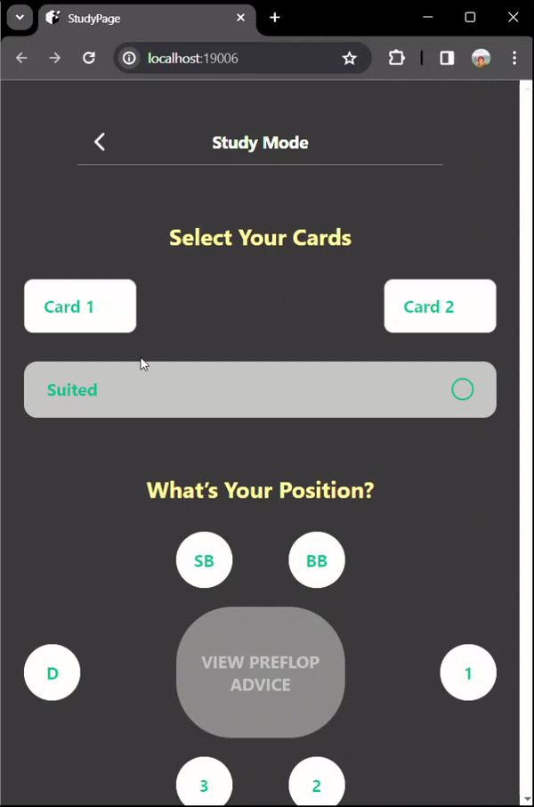
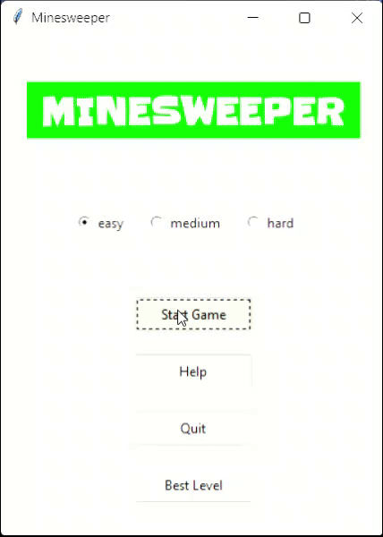
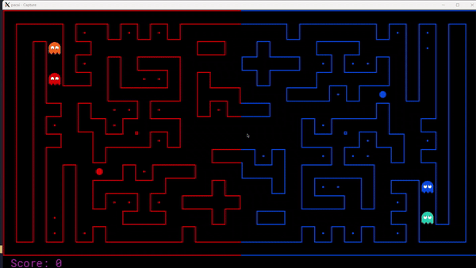

# Software Developer

    <h2>Contact Me</h2>
    
If you'd like to get in touch, feel free to reach out to me with email, Linked-in, or Github. 

    <a href="mailto:g.jun375181031@gmail.com" class="contact-button">Email</a>
    <a href="https://www.linkedin.com/in/jun-hayashida-a34092244/" class="contact-button">LinkedIn</a>
    <a href="https://github.com/juhayash" class="contact-button">Github</a>

### Technical Skills: Python, C++, C, ReactNative, Scrum

## Education		        		
- B.S., Computer Science | University of California Santa Cruz (_September 2022 - Dec 2023_)
- A.S., Computer Science | Diablo Valle College (_September 2019 - May 2022_)

## Personal Projects
### Poker AI
#### Demo
  

#### Description
- Role: Project owner
- Led a team of five developers and contributed to the development of a Poker-AI application for Texas Hold’em Poker.
- Managed project features, sprint planning, and product backlog prioritization.
- Designed the hand-evaluation function for optimal preflop actions and validated results against GTO AI data in **python**.
- Developed both low and high-fidelity wireframes for user- friendly app interfaces in **React Native**.
- Implemented agile methodologies and Scrum practices, overcoming challenges in front-end development and task estimation.

### Mine Sweeper AI
#### Demo
  

#### Description
- Establishing the foundational mechanics of the Minesweeper game in **Python**, ensuring seamless interaction between the base gameplay elements and the level generation algorithm.
- Spearheaded the UI enhancement initiatives, integrating additional features and diverse visual elements to elevate the user experience.
- Actively involved in debugging and refining the core gameplay and level generation scripts to optimize performance and user engagement.

### Pac-Man AI
#### Demo
  

#### Description
- Implemented a reflex agent, considering various game state features and legal actions in **Python**.
- Created distinct strategies for offensive and defensive agents, including features like proximity to food, capsules, and ghosts, and game score dynamics.
- Utilized a weighted scoring system to evaluate game states and determine optimal agent actions.

## Work Experience
**Disability Resource Center Peer Notetaker @ University of California Santa Cruz (_Jan 2023 - Dec 2023_)**
- Contributed to the DRC department by taking organized lecture notes and providing support for poeple in need for a year.

**High-School Cramschool Tutor @ Rinkai Seminor (_May 2018 - Dec 2022_)**
- Provided in-person/online tutoring services to high school students.
- Provided lectures for Math, Physics, and English.

